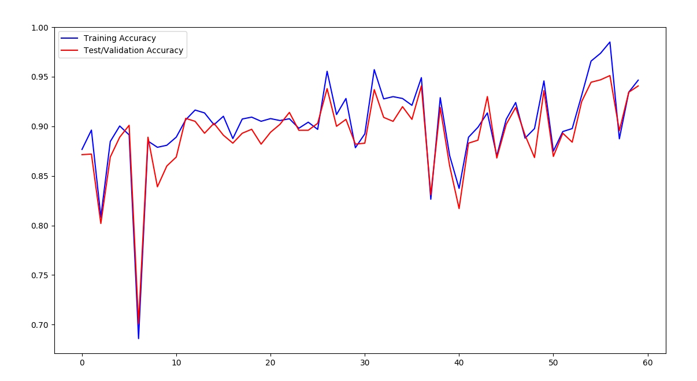

# naive-ocr
A naive ocr that uses Artificial Neural Network built from scratch.

## Dependencies
`python3` and `virtualenv` for python3 are used

## Installation

### Create virtual environment
```bash
virtualenv ocr
```
### Activate the environment
`cd` into the new  directory **ocr**
```bash
source bin/activate
```

You should be able to see the name of the environment after the activation


### Install dependencies
```bash
pip install -r requirements.txt
```

### Download the data
- Download the data from https://drive.google.com/open?id=1MExqrcMutclcYtPZV3vc1n1RFHxqnouT  
- Put the data as **data/**

## Usage
Run `ocr.py` as:

```bash
python ocr.py
```

To test the ocr, you have to put a **.jpg** image inside data/ as **test.jpg**.  

The script tries to test the image from the path **data/test.jpg** accordingly.

## Training Result So Far

